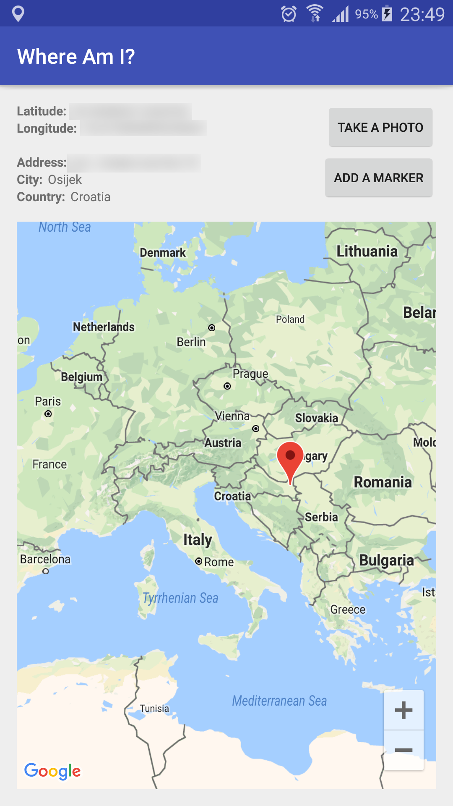

# Homework: Where Am I?

### The assignment and problems encountered

The task of this assignment was to create an application which shows user's location using a marker on a map. The application should show user's latitude, longitude and approximated address, city and country. The user should also be able to add custom markers, and after each successful addition a sound should be played using the SoundPool class. It should also have a button which
takes a picture and saves it using a name which in some manner contains the current location. The image should be viewable through a notification which opens the Gallery app. Finally, the application should be built and signed using a key with a lifespan of 50 years.

### Utilised snippets/solutions/libraries/SO answers

* https://developers.google.com/android/guides/setup
* https://developers.google.com/android/reference/com/google/android/gms/maps/model/LatLng
* https://stackoverflow.com/questions/13692398/remove-a-marker-from-a-googlemap
* https://stackoverflow.com/questions/16056366/android-google-maps-how-to-get-the-area-which-is-currently-shown-in-screen-devi
* https://developer.android.com/guide/topics/ui/controls/radiobutton
* https://developer.android.com/reference/android/media/SoundPool
* https://developer.android.com/guide/topics/media/camera
* https://stackoverflow.com/questions/18605440/android-canvas-save-always-java-io-ioexception-open-failed-enoent-no-such-fil
* https://stackoverflow.com/questions/46550472/fileprovider-geturiforfile-returns-nullpointerexception
* http://soundbible.com/2148-Chinese-Gong.html [sound sample played when a marker is added]

### Screenshots

Samsung Galaxy Note 3 (SM-N900) running Lollipop (5.0)

### Bottom line

I thought ButterKnife would be able to do fragment binding or injecting too, but it [is](https://github.com/JakeWharton/butterknife/issues/15) [not](https://github.com/JakeWharton/butterknife/issues/685).
